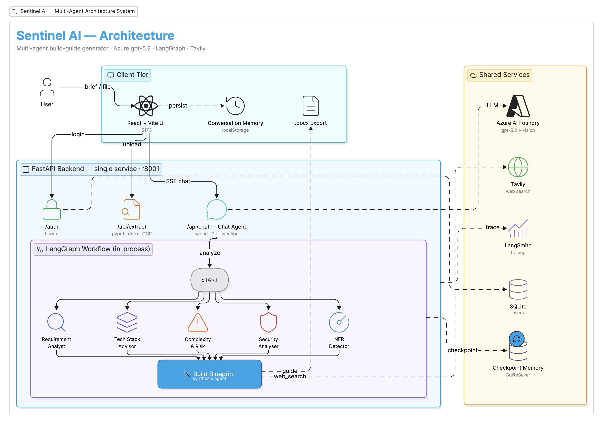

# 🛡️ Sentinel AI — Requirement Autopsy & Build Guide Engine

> Paste a project brief (or upload a PDF / Word doc / screenshot) and Sentinel AI turns it into a concrete, costed **build guide** — what technology to use, how to start, what it costs, and what to watch out for — so **any engineer can begin building without waiting on the senior lead.**

Sentinel AI attacks the most expensive failure mode in software teams: when a new project lands, only one senior person knows *how* to build it, becomes a bottleneck, and makes every decision alone. Sentinel turns a raw requirement into an expert-level, opinionated, vendor-neutral build blueprint in ~90 seconds.

---

## ✨ What it does

1. **Understands the brief** — typed, pasted, or extracted from an uploaded **PDF / Word / text file / image** (screenshots & whiteboards are transcribed by a vision model).
2. **Runs 5 specialist AI agents in parallel**, each researching the requirement live with web search.
3. **Synthesises one Build Guide** — problem statement, budget tiers, recommended stack with priced alternatives, expert implementation techniques, step-by-step build plan, deployment, cost, risks, and a security checklist.
4. **Stays interactive** — ask follow-up questions ("why Postgres?", "what if we use Azure?") answered with the report in context plus live web search.
5. **Exports** the guide to **Word (.docx)** and tracks **token cost** per session.

---

## 🏗️ Architecture Overview



<details>
<summary>Text version of the architecture</summary>

```
                ┌──────────────────────────────────────────────────┐
  User brief →  │  React UI (chat)  ──►  FastAPI — single service   │
  PDF/img/doc   │                        (port 8001)                │
                │   - /auth         signup/login (bcrypt + JWT)     │
                │   - /api/extract  PDF / DOCX / TXT + image OCR    │
                │   - /api/chat     guardrailed LLM proxy (stream)  │
                │   - /api/sessions server-side chat history        │
                └───────────────────────┬──────────────────────────┘
                                         │ brief detected → runs IN-PROCESS
                                         ▼
                ┌──────────────────────────────────────────────────┐
                │   LangGraph workflow (in-process, no extra server) │
                │                                                    │
   START ──┬──► Requirement Analyst ──┐                              │
           ├──► Tech Stack Advisor  ──┤                              │
           ├──► Complexity & Risk   ──┼──► Build Blueprint ──► END
           ├──► Security Analyser   ──┤    (synthesis agent)         │
           └──► NFR Detector        ──┘                              │
                (5 agents run in parallel, each with web_search)
                └──────────────────────────────────────────────────┘
```

</details>

- **Single deployable backend.** The LangGraph workflow runs **in-process** inside FastAPI (`graph.astream`) — no separate `langgraph dev` server is needed to run the app.
- **5 parallel analysis agents** each answer one question (what to build, what to use + cost, what's hard / risky, security, performance & scale). They run concurrently via LangGraph fan-out.
- **1 synthesis agent** (`build_blueprint`) reads all 5 reports, resolves cross-agent conflicts, verifies facts via web search, and produces the final guide.
- Every agent is a **LangChain `create_agent`** with **structured (Pydantic) output**, **model + tool retry middleware**, and an **in-memory checkpointer** for resilient retry loops.
- **Graceful degradation:** each agent is wrapped so one failure never crashes the run — the remaining agents still produce a guide, with errors recorded.

### Anti-hallucination & no vendor bias
Agents must commit to concrete recommendations with stated assumptions (never "TBD"), verify prices/versions with live web search rather than memory, and treat AWS/Azure/GCP and OpenAI/Anthropic/Gemini/open-source as equally valid — preferring the team's existing ecosystem.

---

## 🤖 AI Tools & Tech Stack

| Layer | Technology |
|---|---|
| **LLM** | `gpt-5.2` via **Azure AI Foundry** (OpenAI-compatible endpoint), incl. vision for image OCR |
| **Agent framework** | **LangChain** `create_agent` + `ModelRetryMiddleware`, `ToolRetryMiddleware` |
| **Orchestration** | **LangGraph** (in-process parallel fan-out → synthesis), in-memory checkpointer |
| **Web research tool** | **Tavily** search API (`web_search` tool) |
| **Observability** | **LangSmith** tracing |
| **Backend** | **FastAPI** + Uvicorn — single service (auth, chat proxy, extraction, sessions, workflow) |
| **Auth** | **JWT** (PyJWT) signed tokens + **bcrypt** password hashing + password-strength policy |
| **Storage** | **SQLite** — users, server-side chat sessions, usage limits |
| **Doc extraction** | `pypdf` (PDF), `python-docx` (Word), vision LLM (images) |
| **Frontend** | **React 19 + Vite + TypeScript + Tailwind CSS** |
| **Export** | `docx` (Word build-guide export) |
| **Testing** | `pytest` + `pytest-asyncio` (20 tests, mocked LLM) |

---

## 📁 Repository Structure

```
Hackthon/
├── Sentinel-AI-/                 # Backend (single FastAPI service)
│   ├── auth_server.py            # FastAPI entry — port 8001
│   ├── langgraph.json            # LangGraph config (optional Studio view only)
│   ├── start.sh                  # runs the backend (python auth_server.py)
│   ├── requirements.txt
│   ├── data/                     # SQLite DB (users, sessions, usage)
│   ├── test/                     # 20 pytest tests
│   └── src/
│       ├── agents/               # 5 analysis agents + build_blueprint
│       ├── prompts/              # one prompt per agent + shared grounding
│       ├── graphs/workflow.py    # LangGraph fan-out → synthesis
│       ├── models/state.py       # shared graph state
│       ├── tools/web_search.py   # Tavily tool
│       └── utils/                # auth, chat, extract, sessions, database, jwt_auth
└── Sentinel_frontend/            # Frontend (React + Vite)
    └── src/
        ├── components/           # AuthPage, Sidebar, ChatMessage, AnalysisReport…
        └── utils/                # api, auth, exportDocx
```

---

## ⚙️ Setup Instructions

### Prerequisites
- **Python 3.12+**, **Node.js 18+**, npm
- An **Azure AI Foundry** deployment of a `gpt-5.2`-class model, and a **Tavily** API key

### 1. Backend (`Sentinel-AI-/`)
```bash
cd Sentinel-AI-
python3 -m venv venv && source venv/bin/activate
pip install -r requirements.txt
```

Create `Sentinel-AI-/.env`:
```env
azure_endpoint="https://<your-resource>.services.ai.azure.com/openai/v1"
FOUNDRY_API_KEY="<your-azure-foundry-key>"
OPENAI_MODEL="gpt-5.2"
TAVILY_API_KEY="<your-tavily-key>"
JWT_SECRET="<any-long-random-string>"
LANGCHAIN_API_KEY="<optional-langsmith-key>"
LANGCHAIN_TRACING_V2=true
LANGCHAIN_PROJECT="Sentinel AI"
```

### 2. Frontend (`Sentinel_frontend/`)
```bash
cd Sentinel_frontend
npm install
```
No secrets live in the frontend — all API keys stay server-side.

---

## ▶️ Running the App

Just **two terminals** — the LangGraph workflow runs inside the backend, so there's no separate server to start:

```bash
# Terminal 1 — backend (FastAPI on :8001)
cd Sentinel-AI- && source venv/bin/activate && python auth_server.py

# Terminal 2 — frontend (Vite on :5173)
cd Sentinel_frontend && npm run dev
```

Then open **http://localhost:5173**, create an account, sign in, and paste/upload a project brief.

> Optional: to inspect the agent graph visually in LangGraph Studio, run `langgraph dev` separately — the app does not require it.

---

## 🧪 Testing

```bash
cd Sentinel-AI- && source venv/bin/activate && pytest test/ -v
```
20 tests cover the agents, the full LangGraph orchestration, the auth + chat API (incl. JWT-protected routes), the database layer, and the web-search tool. The LLM is mocked, so tests run in ~2s with no API cost.

---

## ☁️ Deployment (Azure)

Both services are containerised and deployed to **Azure Container Apps** — a serverless container platform that **scales to zero** when idle, so you only pay while requests are being served (ideal for a demo / hackathon budget).

### Architecture
```
                    ┌─────────────────────────────┐
   Browser  ──────► │  Frontend Container App      │   (nginx serving the Vite build)
                    │  sentinel-frontend           │
                    └──────────────┬──────────────┘
                                   │  HTTPS  (VITE_API_URL)
                                   ▼
                    ┌─────────────────────────────┐
                    │  Backend Container App        │   (FastAPI + LangGraph, :8001)
                    │  sentinel-backend            │   secrets injected as env vars
                    └──────────────┬──────────────┘
                                   │
                          Azure AI Foundry (gpt-5.2) · Tavily
```

| Component | Image | Hosting |
|---|---|---|
| **Backend** | `python:3.12-slim` → FastAPI on `:8001` | Azure Container App (scale-to-zero) |
| **Frontend** | `node:20` build → **nginx** static serve on `:80` | Azure Container App |
| **Registry** | both images | Azure Container Registry (auto-created) |

> 🔐 **No secrets are baked into the images.** The backend `.env` is excluded via `.dockerignore`; all keys (Foundry, Tavily, JWT, LangChain) are injected at runtime as Azure Container App environment variables. The frontend image contains only the **public backend URL** (`VITE_API_URL`).

### Prerequisites
- **Azure CLI** logged in (`az login`)
- A **resource group** and an **Azure AI Foundry** `gpt-5.2` deployment
- One-time provider registration:
  ```bash
  az provider register -n Microsoft.App --wait
  az provider register -n Microsoft.OperationalInsights --wait
  az provider register -n Microsoft.ContainerRegistry --wait
  ```

### 1. Deploy the backend
```bash
cd Sentinel-AI-
az containerapp up \
  --name sentinel-backend \
  --resource-group <your-rg> \
  --source . \
  --ingress external --target-port 8001 \
  --env-vars \
    azure_endpoint="https://<resource>.services.ai.azure.com/openai/v1" \
    FOUNDRY_API_KEY="<key>" \
    OPENAI_MODEL="gpt-5.2" \
    TAVILY_API_KEY="<key>" \
    JWT_SECRET="<long-random-string>" \
    LANGCHAIN_TRACING_V2=false \
    ALLOWED_ORIGINS="https://<your-frontend-url>"
```
Copy the backend URL it prints (e.g. `https://sentinel-backend.<region>.azurecontainerapps.io`).

### 2. Deploy the frontend
Set the backend URL in `Sentinel_frontend/.env.production` (Vite reads `VITE_*` at build time):
```env
VITE_API_URL=https://sentinel-backend.<region>.azurecontainerapps.io
```
Then build & deploy:
```bash
cd Sentinel_frontend
az containerapp up \
  --name sentinel-frontend \
  --resource-group <your-rg> \
  --source . \
  --ingress external --target-port 80
```

### 3. Wire CORS
Update the backend's `ALLOWED_ORIGINS` env var to the deployed frontend URL so browser requests are accepted:
```bash
az containerapp update \
  --name sentinel-backend --resource-group <your-rg> \
  --set-env-vars ALLOWED_ORIGINS="https://sentinel-frontend.<region>.azurecontainerapps.io"
```

### Cost & cold-start notes
- **Scale-to-zero** keeps idle cost near $0; you mostly pay for Azure AI Foundry token usage.
- First request after idle has a **cold-start delay** (a few seconds). For live judging, pin one warm instance:
  ```bash
  az containerapp update --name sentinel-backend --resource-group <your-rg> --min-replicas 1
  ```
- **Storage note:** the container uses **SQLite on the container filesystem**, which is *ephemeral* — users/sessions reset when the container restarts. For persistent data, migrate to **Azure Database for PostgreSQL** and point `database.py` at it.

---

## 🚀 Key Features

- 📄 **Multi-format input** — type, paste, or upload PDF / Word / text / **image (vision OCR)**
- ⚡ **Parallel multi-agent analysis** with live web research
- 💰 **Budget tiers** (Lean / Balanced / Scale) + **priced alternatives** per layer — the user chooses by cost
- 🧠 **Expert implementation techniques** — frameworks, patterns, libraries, not just tool names
- 💬 **Follow-up Q&A** grounded in the report + live web search
- 📥 **Word (.docx) export** of the full build guide
- 🔢 **Live token-cost tracking** + server-side **usage limits**
- 🔐 **JWT auth** + bcrypt + password-strength policy; **server-side chat history** scoped per user
- 🛡️ **Guardrails** — scope control (rejects off-topic / injection), anti-hallucination & vendor-neutral policies

---

## 👥 Team


| Name | Role | Responsibilities |
|---|---|---|
| Vishnu Singh | Senior Machine Learning Engineer | Agent design, LangGraph workflow, backend & frontend |

---

## 🤖 Use of AI Tools

In line with the hackathon guidelines, the following AI-powered tools were used during development of this project:

- **GitHub Copilot** — in-editor code completion and boilerplate suggestions.
- **AI coding assistants (LLM-based)** — used for scaffolding modules, refactoring, writing tests, and drafting documentation.

These tools accelerated routine work, but the **architecture, product decisions, agent design, and engineering judgment are our own.** Every AI-generated suggestion was reviewed, tested, and adapted to fit the system. Key human-led decisions include: the multi-agent build-guide approach (over a simple readiness score), the prompt engineering and vendor-neutral / anti-hallucination grounding strategy, the parallel LangGraph fan-out → synthesis orchestration, the server-side security model (JWT + bcrypt, all LLM keys server-side only), the token-cost tracking and usage limits, and the budget-tier output design. AI-generated boilerplate alone was never treated as a finished solution.

---

*Built for the Microsoft Hackathon · Powered by Azure AI Foundry, LangGraph & LangChain.*
